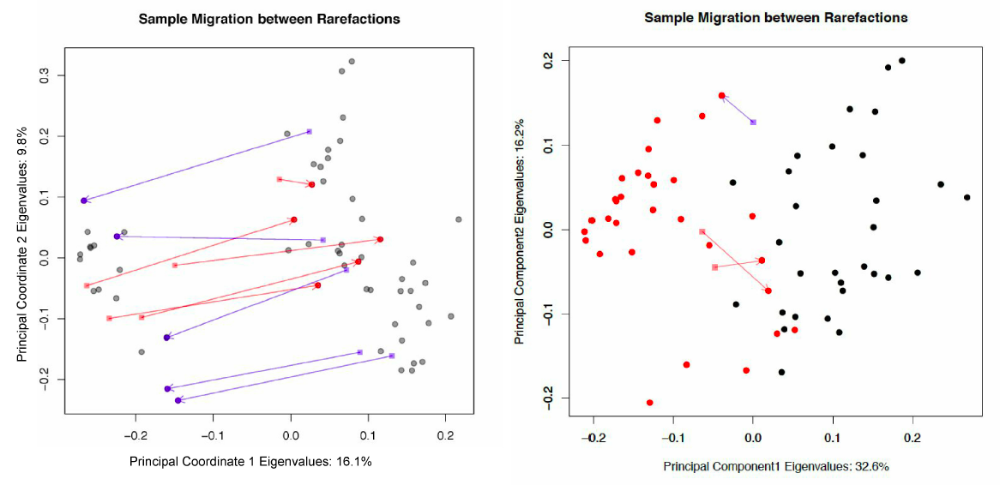
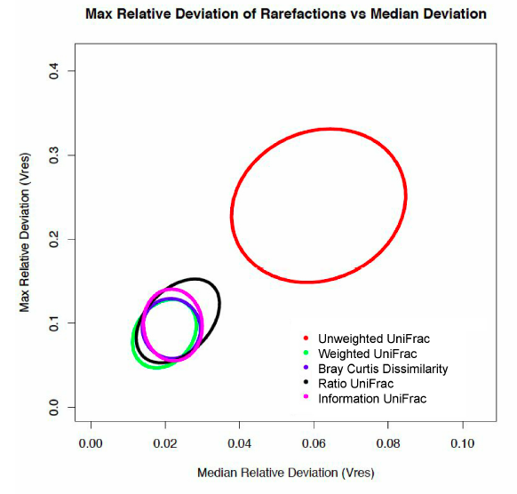
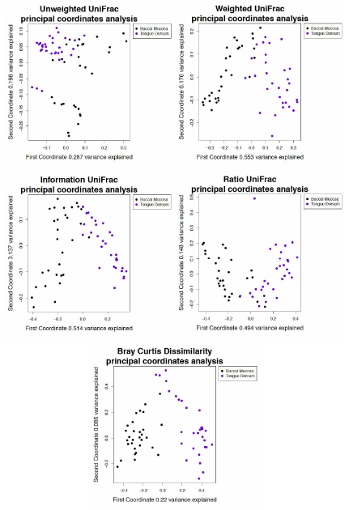
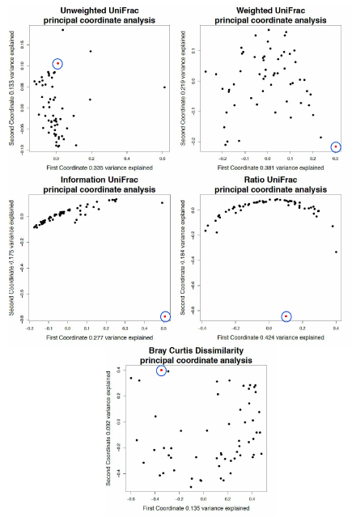
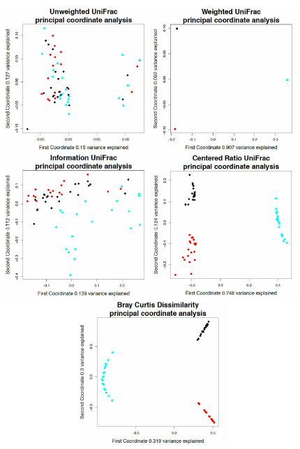
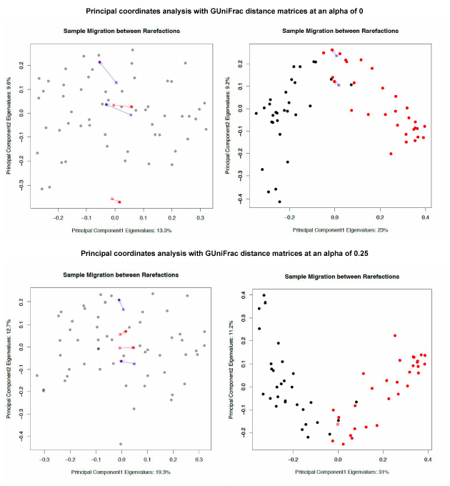
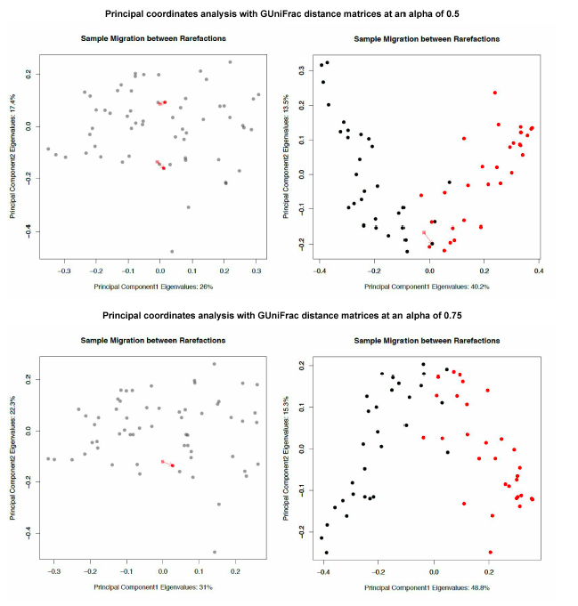
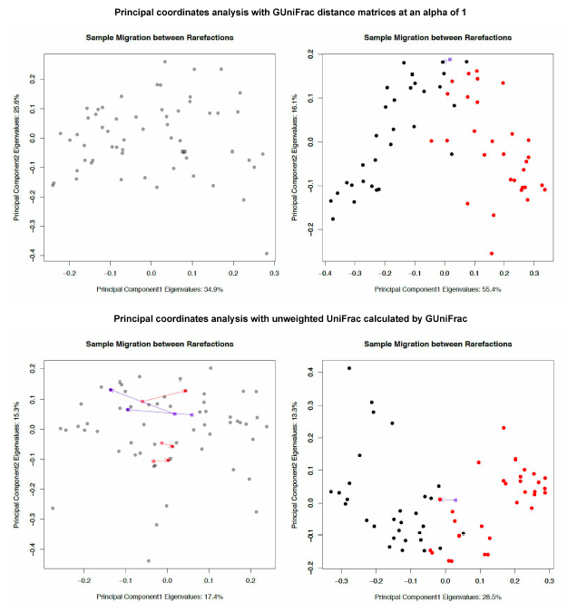
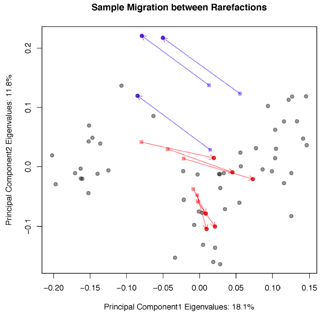
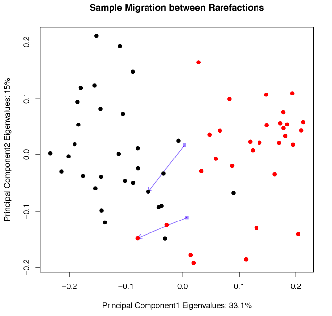

# Scripts for generating paper figures

All the figures from the paper Expanding the UniFrac toolbox, submitted to Great Lakes Bioinformatics and the Canadian Computational Biology Conference 2016 (https://www.iscb.org/glbioccbc2016)

The paper can be found here: https://github.com/ruthgrace/unifrac_paper

In this repository, the scripts often use the same data sets, so the data sets are stored separately in the [data folder](data).

## Sample migration in different rarefactions, plotted on principal coordinates, measured with unweighted UniFrac.

[Tongue dorsum sample migration code](tongue_sample_migration)

[Tongue dorsum vs. buccal mucosa sample migration code](tongue_cheek_migration)

Output:

## Maxiumum relative deviation of rarefactions versus median deviation for traditional and non-traditional microbiome dissimilarity metrics.

[Ellipses plot code](tongue_ellipses)

Output:

## Analysis of tongue and buccal mucosa data using different UniFrac weightings.

[PCoA plot code](tongue_dorsum_vs_buccal_mucosa)

Output:

## Analysis of breast milk data using different UniFrac weightings.

[PCoA plot code](breastmilk)

Output:

## Analysis of simulated monocultures using different UniFrac weightings.

[PCoA plot code](monoculture)

Output:

## Principal Coordinate Analysis derived from GUniFrac distance matrices.

These figures are in the supporting information section.

[GUniFrac sample migration plot code](supporting_information/gunifrac_migration)

Output:

## Principal coordinate analysis derived from tongue dorsum samples using unweighted UniFrac distance matrices with no tree pruning.

This figure is in the supporting information section.

[Tongue dorsum sample migration without tree pruning plot code](supporting_information/tongue_tongue_no_tree_pruning)

Output:

## Principal coordinate analysis derived from tongue dorsum and buccal mucosa samples using unweighted UniFrac distance matrices with no tree pruning.

This figure is in the supporting information section.

[Tongue dorsum vs. buccal mucosa sample migration without tree pruning plot code](supporting_information/tongue_cheek_no_tree_pruning)

Output:

